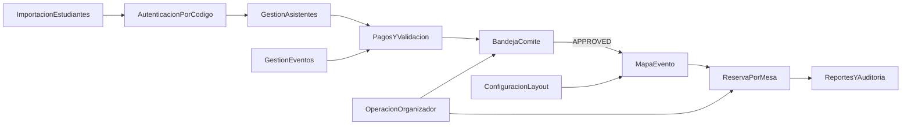

# Casos de uso y requerimientos funcionales — Reserva de cupos en mesas

Documento alineado con `1.Definicion_producto_gestion_ubicaciones_eventos.md` y `2.Catalogo_reglas_de_negocio_gestion_ubicaciones.md`.

---

## 1. Mapa de módulos del sistema

| Módulo | Propósito | Actores principales |
|--------|-----------|---------------------|
| **Importación de estudiantes** | Cargar el padrón base con códigos únicos por evento. | Comité organizador |
| **Autenticación por código** | Permitir el acceso del comprador con `codigo_estudiante`. | Estudiante o familia |
| **Administración de salones** | Mantener salones, layouts y configuración general del espacio. | Administrador, comité |
| **Configuración de layout** | Definir mesas, zonas, elementos fijos y estado operativo del mapa. | Administrador, comité |
| **Gestión de eventos** | Configurar etapas, topes comerciales y políticas operativas del evento. | Comité organizador |
| **Gestión de asistentes** | Registrar y mantener los datos obligatorios de los participantes. | Comprador |
| **Pagos y validación** | Crear pagos, adjuntar evidencia y gestionar estados. | Comprador, comité |
| **Bandeja del comité** | Revisar, aprobar, rechazar o corregir pagos. | Comité organizador |
| **Políticas y consentimiento** | Administrar documentos legales del evento y registrar aceptación del comprador. | Comité organizador, comprador |
| **Reserva por mesa** | Asignar cupos de forma definitiva en una mesa. | Comprador, sistema |
| **Mapa del evento** | Mostrar mesas y cupos disponibles o reservados. | Comprador, comité |
| **Operación del organizador** | Resolver excepciones y ajustes manuales. | Comité organizador |
| **Reportes y auditoría** | Trazar operaciones críticas y consultar el estado operativo. | Comité, administrador |

---

## 2. Requerimientos funcionales por módulo

### 2.1 Importación de estudiantes

| ID | Requerimiento |
|----|----------------|
| RF-IMP-01 | El sistema debe permitir cargar un archivo CSV o Excel con estudiantes y sus códigos únicos. |
| RF-IMP-02 | El sistema debe validar duplicados, filas inválidas y estructura exacta de tres columnas: `codigo_unico`, `apellidos`, `nombres`. |
| RF-IMP-03 | El evento no puede abrirse al comprador sin un padrón importado vigente. |

### 2.2 Autenticación por código

| ID | Requerimiento |
|----|----------------|
| RF-AUTH-01 | El comprador debe poder iniciar sesión ingresando su `codigo_estudiante`. |
| RF-AUTH-02 | El sistema debe rechazar códigos inexistentes, inactivos o no asociados al evento vigente. |
| RF-AUTH-03 | El acceso exitoso debe vincular al comprador con su grupo operativo dentro del evento. |
| RF-AUTH-04 | El sistema debe impedir que un código de estudiante cree más de un grupo comprador por evento; los ingresos posteriores deben reutilizar el mismo proceso existente. |

### 2.3 Administración de salones y layout

| ID | Requerimiento |
|----|----------------|
| RF-SAL-01 | El sistema debe permitir crear y mantener salones y sus layouts asociados. |
| RF-LAY-01 | El layout debe representar las mesas del evento y sus capacidades. |
| RF-LAY-02 | El sistema debe permitir definir zonas o mesas no disponibles para reserva pública. |
| RF-LAY-03 | La capacidad física del evento debe derivarse del layout configurado. |

### 2.4 Gestión de eventos

| ID | Requerimiento |
|----|----------------|
| RF-EVE-01 | El sistema debe permitir crear un evento y asociarlo a un salón/layout. |
| RF-EVE-02 | El sistema debe configurar etapas comerciales y calcular la etapa vigente. |
| RF-EVE-03 | El sistema debe aplicar topes de compra: `4` en preventa y `3` en venta general. |
| RF-EVE-04 | El sistema debe permitir definir parámetros operativos como visibilidad del mapa y apertura del evento. |
| RF-EVE-05 | El evento debe almacenar fecha de inicio y fin de preventa, fecha de inicio y fin de venta general y fecha del evento. |
| RF-EVE-06 | El evento debe almacenar nombre del lugar, dirección y geolocalización (`lat`, `lon`). |
| RF-EVE-07 | El evento debe permitir administrar la política de tratamiento de datos y los términos y condiciones vigentes. |

### 2.5 Gestión de asistentes

| ID | Requerimiento |
|----|----------------|
| RF-ASI-01 | El comprador debe poder registrar asistentes vinculados a su grupo. |
| RF-ASI-02 | Cada asistente debe incluir nombres, apellidos, tipo de documento, número de documento, vegetariano, alergias, número celular, nombre y teléfono de contacto de emergencia e indicador de movilidad reducida o uso de silla de ruedas. |
| RF-ASI-03 | El sistema debe impedir enviar el pago a revisión si los asistentes requeridos no están completos. |
| RF-ASI-04 | El comprador debe poder editar participantes hasta 20 días antes de la fecha del evento. |
| RF-ASI-05 | Después del umbral de 20 días previos al evento, solo el administrador del sistema puede modificar participantes. |

### 2.6 Pagos y validación

| ID | Requerimiento |
|----|----------------|
| RF-PAY-01 | El comprador debe poder crear un pago en borrador indicando cantidad de boletas y tipo de pago. |
| RF-PAY-02 | El sistema debe requerir comprobante para pagos digitales antes de enviarlos a revisión. |
| RF-PAY-03 | El comprador debe poder editar o eliminar el pago mientras no esté aprobado. |
| RF-PAY-04 | El comité debe poder aprobar o rechazar pagos en revisión. |
| RF-PAY-05 | El comité debe poder registrar pagos en efectivo con la foto del recibo de caja como evidencia obligatoria. |
| RF-PAY-06 | Un pago aprobado debe bloquear la edición del registro por parte del comprador. |

### 2.7 Políticas y consentimiento

| ID | Requerimiento |
|----|----------------|
| RF-LEG-01 | El sistema debe permitir crear, editar, publicar y consultar la política de tratamiento de datos del evento. |
| RF-LEG-02 | El sistema debe permitir crear, editar, publicar y consultar los términos y condiciones del evento. |
| RF-LEG-03 | El comprador debe aceptar explícitamente ambos documentos antes de confirmar la reserva. |
| RF-LEG-04 | El sistema debe registrar fecha, versión y actor de la aceptación. |
| RF-LEG-05 | La aceptación debe aplicarse a todos los asistentes asociados a la reserva confirmada. |
| RF-LEG-06 | El comprador debe poder consultar posteriormente la versión exacta de la política y los términos aceptados cuando vuelve a ingresar a la aplicación. |

### 2.8 Reserva por mesa

| ID | Requerimiento |
|----|----------------|
| RF-RES-01 | El sistema solo debe habilitar la reserva de cupos para grupos con pago `APPROVED`. |
| RF-RES-02 | La reserva debe realizarse indicando una o varias mesas y la cantidad de cupos por mesa. |
| RF-RES-03 | El sistema debe validar disponibilidad suficiente antes de confirmar la reserva. |
| RF-RES-04 | La operación de reserva debe ser transaccional para evitar sobreocupación y estados parciales en escenarios multi-mesa. |
| RF-RES-05 | La reserva exitosa debe generar códigos secuenciales de reserva por asistente. |
| RF-RES-06 | La aplicación no debe permitir cancelación de reserva ni devolución de pago; debe derivar ese proceso al administrador de la plataforma. |
| RF-RES-07 | Una corrección manual del comité no debe regenerar los códigos de reserva ya emitidos. |
| RF-RES-08 | La interfaz debe mostrar la distribución multi-mesa con mensajes explícitos por mesa y cantidad de puestos. |

### 2.9 Mapa del evento

| ID | Requerimiento |
|----|----------------|
| RF-MAP-01 | El sistema debe mostrar el mapa con disponibilidad agregada por mesa. |
| RF-MAP-02 | El mapa del comprador debe permanecer bloqueado hasta que exista un pago aprobado. |
| RF-MAP-03 | El comité debe visualizar el estado operativo global del mapa y las reservas existentes. |

### 2.10 Operación del organizador

| ID | Requerimiento |
|----|----------------|
| RF-ORG-01 | El comité debe poder corregir pagos y reservas cuando la operación lo requiera. |
| RF-ORG-02 | El organizador debe poder mover o ajustar reservas sin romper las capacidades del layout. |
| RF-ORG-03 | Toda intervención manual debe quedar trazada. |

### 2.11 Reportes y auditoría

| ID | Requerimiento |
|----|----------------|
| RF-AUD-01 | El sistema debe registrar eventos relevantes de importación, autenticación, pagos, aprobaciones y reservas. |
| RF-AUD-02 | El comité debe poder consultar el estado de pagos y reservas por evento. |

---

## 3. Requerimientos no funcionales

| ID | Categoría | Descripción |
|----|------------|-------------|
| RNF-01 | Consistencia | Toda validación funcional debe ser revalidada en backend. |
| RNF-02 | Concurrencia | La reserva de cupos debe protegerse contra accesos concurrentes sobre la misma mesa. |
| RNF-03 | Seguridad | Los comprobantes y evidencias deben almacenarse de forma segura y controlada. |
| RNF-04 | Trazabilidad | Toda aprobación, rechazo o corrección manual debe dejar auditoría. |
| RNF-05 | Usabilidad | El usuario debe entender claramente en qué estado está: borrador, en revisión, aprobado, rechazado, reservado. |
| RNF-06 | Escalabilidad | El diseño debe permitir evolucionar a múltiples eventos y mayores volúmenes de compradores. |
| RNF-07 | Privacidad | El manejo de datos personales de asistentes debe cumplir lineamientos de protección de datos. |

---

## 4. Casos de uso detallados

### UC-01 — Importar estudiantes

| Campo | Contenido |
|-------|-----------|
| **Nombre** | Importar estudiantes |
| **Objetivo** | Cargar el padrón de estudiantes con códigos únicos para habilitar el acceso al evento. |
| **Actores** | Comité organizador |
| **Precondiciones** | Evento creado; archivo CSV o Excel disponible. |
| **Flujo principal** | 1. El comité selecciona el archivo. 2. El sistema valida estructura, encabezados y duplicados. 3. El sistema registra los estudiantes válidos. 4. El padrón queda activo para el evento. |
| **Flujos alternos** | A) Archivo inválido: el sistema rechaza la importación e informa errores. B) Registros duplicados: se marcan y no se importan hasta corregirlos. C) El archivo no contiene exactamente `codigo_unico`, `apellidos`, `nombres`: rechazo estructural. |
| **Postcondiciones** | Los códigos quedan habilitados para autenticación. |
| **Reglas de negocio** | `RN-IMP-01`, `RN-IMP-02`, `RN-AUTH-01`. |

### UC-02 — Ingresar con código único

| Campo | Contenido |
|-------|-----------|
| **Nombre** | Ingresar con código único |
| **Objetivo** | Permitir que el estudiante o familia acceda a su flujo operativo. |
| **Actores** | Comprador |
| **Precondiciones** | Padrón importado y código vigente. |
| **Flujo principal** | 1. El usuario ingresa su código. 2. El sistema valida el código contra el evento. 3. El sistema habilita el acceso al grupo. |
| **Flujos alternos** | A) Código inválido o inactivo: el acceso se rechaza. B) Código ya utilizado en el evento: el sistema reabre el proceso existente del mismo grupo y evita crear uno nuevo. |
| **Postcondiciones** | El grupo queda autenticado. |
| **Reglas de negocio** | `RN-AUTH-01`, `RN-AUTH-02`. |

### UC-03 — Registrar asistentes

| Campo | Contenido |
|-------|-----------|
| **Nombre** | Registrar asistentes |
| **Objetivo** | Capturar la información obligatoria de las personas cubiertas por la compra. |
| **Actores** | Comprador |
| **Precondiciones** | Usuario autenticado. |
| **Flujo principal** | 1. El comprador crea o edita asistentes. 2. El sistema valida campos obligatorios y ventana temporal de edición. 3. El sistema guarda el listado del grupo. |
| **Flujos alternos** | A) Datos incompletos: el sistema bloquea el avance. B) Faltan menos de 20 días para el evento: el comprador solo puede consultar y debe contactar al administrador para cambios. |
| **Postcondiciones** | El grupo cuenta con asistentes válidos para continuar. |
| **Reglas de negocio** | `RN-PAR-01`, `RN-PAR-02`. |

### UC-04 — Registrar pago externo

| Campo | Contenido |
|-------|-----------|
| **Nombre** | Registrar pago externo |
| **Objetivo** | Crear un pago con cantidad de boletas, tipo y evidencia. |
| **Actores** | Comprador |
| **Precondiciones** | Usuario autenticado; asistentes diligenciados; evento en etapa válida. |
| **Flujo principal** | 1. El comprador indica cantidad de boletas. 2. El sistema valida el tope según etapa. 3. El comprador define tipo de pago. 4. Si es digital, adjunta comprobante. 5. El sistema guarda el pago como borrador o lo envía a revisión. |
| **Flujos alternos** | A) Excede el tope: rechazo. B) Falta evidencia digital: no puede enviarse a revisión. |
| **Postcondiciones** | Existe un pago en `DRAFT` o `PENDING_APPROVAL`. |
| **Reglas de negocio** | `RN-TIME-01`, `RN-TIME-02`, `RN-TIME-03`, `RN-PAY-01`, `RN-PAY-02`, `RN-PAY-04`, `RN-PAY-05`. |

### UC-05 — Revisar y decidir pago

| Campo | Contenido |
|-------|-----------|
| **Nombre** | Revisar y decidir pago |
| **Objetivo** | Permitir que el comité apruebe o rechace un pago reportado. |
| **Actores** | Comité organizador |
| **Precondiciones** | Pago en `PENDING_APPROVAL`. |
| **Flujo principal** | 1. El comité abre la bandeja de pagos. 2. Revisa datos y evidencia. 3. Aprueba o rechaza. 4. El sistema actualiza el estado y deja trazabilidad. |
| **Flujos alternos** | A) La evidencia no es suficiente: rechazo. B) El comité requiere corrección manual: registra observaciones y mantiene o cambia el estado según política. |
| **Postcondiciones** | El pago queda en `APPROVED` o `REJECTED`. |
| **Reglas de negocio** | `RN-PAY-01`, `RN-PAY-06`, `RN-PAY-07`, `RN-ORG-01`. |

### UC-06 — Gestionar política y términos del evento

| Campo | Contenido |
|-------|-----------|
| **Nombre** | Gestionar política y términos del evento |
| **Objetivo** | Permitir al comité administrar el contenido legal vigente del evento. |
| **Actores** | Comité organizador, administrador del sistema |
| **Precondiciones** | Evento existente y permisos de staff. |
| **Flujo principal** | 1. El comité abre la configuración legal del evento. 2. Crea o edita la política de tratamiento de datos y los términos y condiciones. 3. Publica la versión vigente. 4. El sistema deja trazabilidad de la publicación. |
| **Flujos alternos** | A) Documento incompleto: el sistema bloquea la publicación. |
| **Postcondiciones** | El evento tiene documentos legales vigentes listos para aceptación. |
| **Reglas de negocio** | `RN-EVT-03`, `RN-LEG-01`. |

### UC-07 — Reservar cupos en mesa

| Campo | Contenido |
|-------|-----------|
| **Nombre** | Reservar cupos en mesa |
| **Objetivo** | Asignar definitivamente cupos disponibles de una o varias mesas al grupo comprador. |
| **Actores** | Comprador, sistema |
| **Precondiciones** | Pago `APPROVED`; mapa habilitado; una o varias mesas con cupos disponibles. |
| **Flujo principal** | 1. El comprador abre el mapa. 2. Selecciona una o varias mesas. 3. Indica cuántos cupos reservará en cada una. 4. El sistema presenta política y términos vigentes para aceptación. 5. El comprador confirma la aceptación. 6. El sistema valida capacidad restante, boletas aprobadas y consentimiento. 7. El sistema confirma la reserva de forma atómica, muestra la distribución con mensajes por mesa y genera los códigos secuenciales por asistente. |
| **Flujos alternos** | A) No hay cupos suficientes en alguna mesa: rechazo total. B) Otra solicitud consume los cupos al mismo tiempo: error de concurrencia y recarga de disponibilidad. C) El comprador no acepta la política y los términos: la reserva no se crea. |
| **Postcondiciones** | La reserva queda persistida y visible con detalle por mesa y códigos por asistente. |
| **Reglas de negocio** | `INV-01`, `INV-02`, `INV-03`, `INV-04`, `RN-LEG-02`, `RN-LEG-03`, `RN-LEG-04`, `RN-RES-01`, `RN-RES-02`, `RN-RES-03`, `RN-RES-03A`, `RN-RES-04`, `RN-RES-05`, `RN-CONC-01`, `RN-GLOBAL-01`. |

### UC-08 — Registrar pago en efectivo por staff

| Campo | Contenido |
|-------|-----------|
| **Nombre** | Registrar pago en efectivo por staff |
| **Objetivo** | Permitir que el comité cree o complete un pago en efectivo con soporte operativo. |
| **Actores** | Comité organizador |
| **Precondiciones** | Grupo identificado y etapa válida. |
| **Flujo principal** | 1. El comité busca al estudiante. 2. Registra cantidad de boletas y la foto del recibo de caja. 3. Envía el pago a revisión o lo aprueba según la política operativa. |
| **Flujos alternos** | A) Excede el tope de etapa: rechazo. |
| **Postcondiciones** | El pago queda registrado y trazado. |
| **Reglas de negocio** | `RN-TIME-02`, `RN-TIME-03`, `RN-PAY-04`, `RN-PAY-06`, `RN-PAY-07`. |

### UC-09 — Ajustar reserva o pago manualmente

| Campo | Contenido |
|-------|-----------|
| **Nombre** | Ajustar reserva o pago manualmente |
| **Objetivo** | Resolver excepciones operativas por parte del comité. |
| **Actores** | Comité organizador |
| **Precondiciones** | Permisos de staff; evento activo. |
| **Flujo principal** | 1. El comité identifica el caso. 2. Ejecuta el ajuste sobre pago o reserva. 3. El sistema valida consistencia. 4. El sistema registra auditoría manteniendo los códigos de reserva ya emitidos. |
| **Flujos alternos** | A) El ajuste rompe capacidad de mesa: rechazo. |
| **Postcondiciones** | El estado operativo queda consistente. |
| **Reglas de negocio** | `INV-01`, `RN-ORG-01`, `RN-GLOBAL-01`. |

### UC-10 — Consultar mapa y estado de reserva

| Campo | Contenido |
|-------|-----------|
| **Nombre** | Consultar mapa y estado de reserva |
| **Objetivo** | Mostrar al usuario y al comité el estado del proceso y del mapa según permisos. |
| **Actores** | Comprador, comité |
| **Precondiciones** | Evento configurado. |
| **Flujo principal** | 1. El sistema identifica el rol y estado del pago. 2. Si no hay pago aprobado, muestra estado del proceso sin habilitar reserva. 3. Si hay pago aprobado, muestra el mapa con disponibilidad. |
| **Flujos alternos** | A) Usuario sin autorización: acceso denegado. |
| **Postcondiciones** | El usuario comprende su estado actual y las acciones permitidas. |
| **Reglas de negocio** | `INV-03`, `RN-RES-03`. |

---

## 5. Historias de usuario priorizadas

| Prioridad | ID | Como... | Quiero... | Para... |
|-----------|----|---------|-----------|---------|
| P0 | HU-01 | Comité | importar estudiantes con códigos únicos | habilitar el acceso controlado al evento |
| P0 | HU-02 | Comprador | ingresar con mi código | acceder a mi proceso de compra y reserva |
| P0 | HU-03 | Comprador | registrar a mis asistentes | cumplir con los datos obligatorios del evento |
| P0 | HU-04 | Comprador | registrar mi pago externo | solicitar la aprobación del comité |
| P0 | HU-05 | Comité | revisar pagos en una bandeja | aprobar o rechazar solicitudes con trazabilidad |
| P0 | HU-06 | Comité | administrar la política de tratamiento de datos y los términos del evento | asegurar que el consentimiento se base en documentos vigentes |
| P0 | HU-07 | Comprador | aceptar la política de datos y los términos antes de reservar | completar la reserva válidamente |
| P0 | HU-08 | Comprador | reservar cupos en una o varias mesas solo cuando mi pago esté aprobado | asegurar mi ubicación en el evento |
| P1 | HU-09 | Comité | registrar pagos en efectivo | cubrir operaciones presenciales o manuales |
| P1 | HU-10 | Comité | ajustar manualmente una reserva o pago | resolver excepciones operativas |
| P1 | HU-11 | Comité | consultar auditoría de pagos, reservas y aceptaciones | controlar la operación del evento |
| P1 | HU-12 | Comprador | editar asistentes hasta 20 días antes del evento | corregir información antes del cierre operativo |
| P2 | HU-13 | Administrador | reutilizar layouts y configuraciones | acelerar la preparación de eventos futuros |

---

## 6. Criterios de aceptación

| Épica | Criterio de aceptación |
|-------|------------------------|
| Importación | **Given** un archivo válido de estudiantes, **when** el comité lo importa, **then** cada código queda disponible para autenticación del evento. |
| Login | **Given** un código inexistente, **when** el usuario intenta ingresar, **then** el sistema rechaza el acceso con un mensaje claro. |
| Participantes | **Given** un asistente incompleto, **when** el comprador intenta enviar el pago, **then** el sistema bloquea la acción. |
| Pago digital | **Given** un pago digital sin comprobante, **when** el usuario lo envía a revisión, **then** el sistema rechaza la operación. |
| Topes | **Given** un evento en preventa, **when** el comprador intenta registrar 5 boletas, **then** el sistema rechaza la cantidad. |
| Aprobación | **Given** un pago en revisión, **when** el comité lo aprueba, **then** el sistema habilita el mapa para ese grupo. |
| Consentimiento | **Given** el comprador ya seleccionó mesas y cupos, **when** no acepta la política y los términos vigentes, **then** el sistema no confirma la reserva. |
| Mapa bloqueado | **Given** un pago en `DRAFT`, `PENDING_APPROVAL` o `REJECTED`, **when** el comprador intenta reservar, **then** el mapa permanece bloqueado. |
| Reserva | **Given** una o varias mesas con cupos libres, **when** el comprador intenta reservar más cupos de los disponibles en cualquiera de ellas, **then** el sistema rechaza toda la operación. |
| Visualización multi-mesa | **Given** una reserva distribuida entre varias mesas, **when** el sistema muestra el resumen, **then** presenta mensajes explícitos del tipo `Mesa seleccionada 1 puestos 2` y `Mesa seleccionada 5 puestos 1`. |
| Concurrencia | **Given** dos solicitudes simultáneas sobre la misma mesa con disponibilidad insuficiente para ambas, **when** se procesan, **then** solo una se confirma. |
| Código de reserva | **Given** una reserva exitosa con 4 asistentes, **when** el sistema confirma la operación, **then** asigna 4 códigos secuenciales individuales asociados al pago aprobado y a la reserva. |
| Edición de asistentes | **Given** faltan menos de 20 días para el evento, **when** el comprador intenta editar asistentes, **then** el sistema bloquea la acción y solo permite cambios al administrador. |

---

## 7. Dependencias entre funcionalidades

| Funcionalidad origen | Funcionalidad destino | Tipo de dependencia |
|----------------------|------------------------|---------------------|
| Importación de estudiantes | Autenticación por código | El acceso depende del padrón importado |
| Autenticación por código | Gestión de asistentes | El grupo debe estar autenticado |
| Gestión de asistentes | Pagos y validación | No debe enviarse un pago sin asistentes completos |
| Gestión de eventos | Pagos y validación | Los topes por etapa dependen de la configuración del evento |
| Pagos y validación | Bandeja del comité | Solo pagos enviados pasan a revisión |
| Bandeja del comité | Reserva por mesa | La aprobación habilita el mapa y la reserva |
| Layout | Mapa del evento | La disponibilidad depende de la configuración de mesas |
| Reserva por mesa | Reportes y auditoría | Toda reserva debe quedar trazada |
| Operación del organizador | Pagos y reservas | Las acciones manuales afectan ambos dominios |

---

## 8. Recomendación de MVP vs versión posterior

| Ámbito | MVP | Versión posterior |
|--------|-----|-------------------|
| Acceso | Login por código único | Autenticación federada, enlaces temporales o flujos híbridos |
| Datos base | Importación CSV/Excel por evento | Sincronización con sistemas externos |
| Pago | Pago externo con evidencia y conciliación manual | Integración directa con pasarelas |
| Reserva | Cupos por mesa, incluida reserva multi-mesa atómica | Reglas avanzadas de redistribución y algoritmos de sugerencia |
| Mapa | Vista agregada por mesa | Experiencias gráficas avanzadas y analítica visual |
| Operación | Bandeja del comité y ajustes manuales | Automatizaciones, SLA, reglas avanzadas |
| Reportes | Auditoría básica y estado operativo | Analítica, exportaciones y dashboards ejecutivos |

**Criterio de salida del MVP:** el comité puede importar estudiantes, el comprador puede ingresar con su código, registrar asistentes y pago, el comité puede aprobar o rechazar, y un comprador aprobado puede reservar cupos en una o varias mesas sin violar capacidades, reglas comerciales ni secuencia de códigos por asistente.

---

Este documento reemplaza los casos de uso basados en `HOLD`, sillas individuales y confirmación automática por pasarela. La secuencia oficial es `código -> asistentes -> pago -> aprobación -> reserva`.
