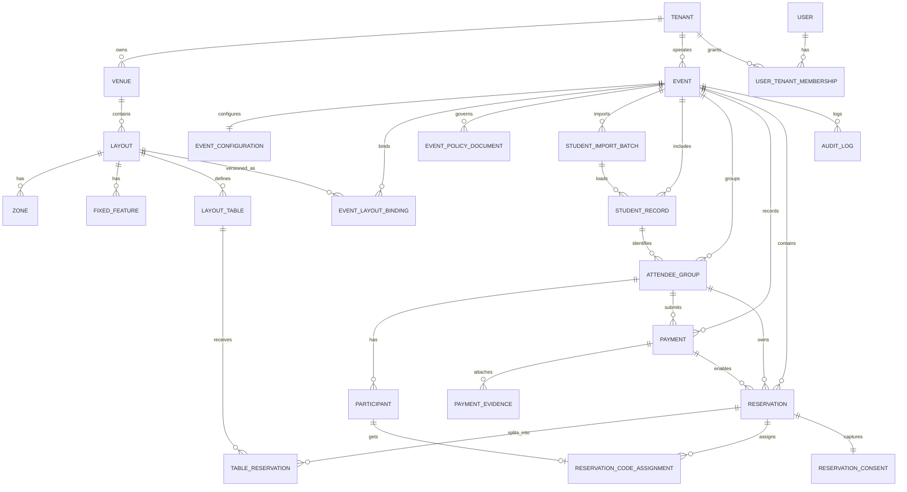

# Modelo de datos lógico y conceptual — Reserva de cupos en mesas

Documento alineado con:

- `1.Definicion_producto_gestion_ubicaciones_eventos.md`
- `2.Catalogo_reglas_de_negocio_gestion_ubicaciones.md`
- `3.Casos_de_uso_y_requerimientos_funcionales.md`

**Principio rector:** la unidad de inventario del MVP es la **mesa con contador de cupos**, no la silla individual. La reserva definitiva solo existe cuando hay un pago en estado `APPROVED`.

---

## 1. Entidades principales

| Ámbito | Entidad |
|--------|---------|
| Organización y acceso | `Tenant`, `User`, `UserTenantMembership`, `EventOrganizerAssignment` |
| Espacio físico | `Venue`, `Layout`, `Zone`, `FixedFeature`, `LayoutTable` |
| Evento y operación | `Event`, `EventConfiguration`, `EventLayoutBinding`, `EventPolicyDocument` |
| Base de compradores | `StudentImportBatch`, `StudentRecord`, `AttendeeGroup` |
| Personas | `Participant` |
| Pagos | `Payment`, `PaymentEvidence` |
| Reservas | `Reservation`, `TableReservation`, `ReservationCodeAssignment`, `ReservationConsent` |
| Auditoría | `AuditLog` |

---

## 2. Descripción de cada entidad

### 2.1 Organización y acceso

**Tenant**  
Agrupa los datos de la organización responsable del sistema.

**User**  
Identidad del personal interno: comité, organizadores, administradores.

**UserTenantMembership**  
Asigna roles internos por organización.

**EventOrganizerAssignment**  
Relaciona usuarios staff con un evento concreto.

### 2.2 Espacio físico

**Venue**  
Salón o recinto donde se celebra el evento.

**Layout**  
Representación versionada del espacio del evento. Permite modelar tarima, pista, zonas y mesas.

**Zone**  
Agrupación lógica o visual de mesas dentro del layout.

**FixedFeature**  
Elemento no reservable del plano, como tarima, pista o salidas.

**LayoutTable**  
Mesa concreta del layout. En el MVP administra capacidad, geometría y ocupación agregada.

### 2.3 Evento y operación

**Event**  
Instancia operativa del negocio: fechas, estado y contexto del evento, incluyendo nombre del lugar, dirección y geolocalización del evento.

**EventConfiguration**  
Parámetros normativos del evento, como topes de preventa y venta general, políticas de visibilidad y etapa comercial.

**EventLayoutBinding**  
Vincula un evento con una versión concreta del layout para no corromper históricos.

**EventPolicyDocument**  
Documento legal versionado del evento. Representa la política de tratamiento de datos o los términos y condiciones vigentes o históricos.

### 2.4 Base de compradores

**StudentImportBatch**  
Registro de una importación masiva de estudiantes.

**StudentRecord**  
Fila de estudiante importado con su código único, apellidos y nombres.

**AttendeeGroup**  
Unidad operativa del comprador para un evento. Agrupa al estudiante, sus asistentes, pagos y reservas, y representa el único uso permitido del código dentro de ese evento.

### 2.5 Personas

**Participant**  
Persona asistente vinculada a un grupo comprador, con datos personales, alimentarios, de emergencia y de movilidad.

### 2.6 Pagos

**Payment**  
Registro de pago externo reportado en la plataforma y sometido a revisión manual.

**PaymentEvidence**  
Archivo o evidencia asociada a un pago digital o en efectivo.

### 2.7 Reservas

**Reservation**  
Cabecera de una operación de reserva confirmada (`reservationId`). Agrupa una o varias mesas asignadas dentro de la misma transacción de negocio.

**TableReservation**  
Detalle por mesa de una reserva definitiva de una cantidad de cupos para un grupo, asociada a un pago aprobado.

**ReservationCodeAssignment**  
Asignación de código secuencial individual (`reservationCode`) a cada participante confirmado dentro de una reserva.

**ReservationConsent**  
Registro de aceptación de política de tratamiento de datos y términos y condiciones vinculada a una reserva.

### 2.8 Auditoría

**AuditLog**  
Registro de eventos relevantes del sistema: importaciones, accesos, pagos, decisiones del comité y reservas.

---

## 3. Atributos sugeridos por entidad

### Tenant
`id`, `name`, `slug`, `status`, `created_at`, `updated_at`

### User
`id`, `email`, `display_name`, `password_hash` o `external_subject`, `status`, `created_at`

### UserTenantMembership
`id`, `tenant_id`, `user_id`, `role`, `created_at`

### EventOrganizerAssignment
`id`, `event_id`, `user_id`, `role`, `created_at`

### Venue
`id`, `tenant_id`, `name`, `address`, `default_timezone`, `created_at`, `updated_at`

### Layout
`id`, `venue_id`, `name`, `status`, `background_image_url`, `version`, `geometry_meta_json`, `created_at`, `updated_at`

### Zone
`id`, `layout_id`, `name`, `geometry_json`, `is_public_selectable`, `sort_order`

### FixedFeature
`id`, `layout_id`, `feature_type`, `label`, `geometry_json`

### LayoutTable
`id`, `layout_id`, `zone_id`, `code`, `table_capacity_limit`, `current_occupied_spots`, `position_json`, `rotation_deg`, `is_public_selectable`, `created_at`, `updated_at`

### Event
`id`, `tenant_id`, `venue_id`, `name`, `event_date`, `starts_at`, `ends_at`, `venue_name_snapshot`, `venue_address_snapshot`, `venue_lat`, `venue_lon`, `status`, `created_at`, `updated_at`

### EventConfiguration
`id`, `event_id`, `timezone`, `presale_start_date`, `presale_end_date`, `sale_start_date`, `sale_end_date`, `max_presale_tickets`, `max_sale_tickets`, `map_visibility_policy`, `created_at`, `updated_at`

### EventLayoutBinding
`id`, `event_id`, `layout_id`, `layout_version`, `bound_at`

### EventPolicyDocument
`id`, `event_id`, `document_type`, `version_label`, `title`, `content_markdown`, `status`, `published_at`, `created_by_user_id`, `created_at`, `updated_at`

### StudentImportBatch
`id`, `event_id`, `uploaded_by_user_id`, `source_file_name`, `status`, `total_rows`, `imported_rows`, `failed_rows`, `created_at`

### StudentRecord
`id`, `import_batch_id`, `event_id`, `student_code`, `last_name`, `first_name`, `metadata_json`, `is_active`, `created_at`

### AttendeeGroup
`id`, `event_id`, `student_record_id`, `student_code_snapshot`, `display_name`, `code_consumed_at`, `current_payment_id`, `approved_ticket_count`, `reservation_status`, `created_at`, `updated_at`

### Participant
`id`, `attendee_group_id`, `first_name`, `last_name`, `document_type`, `document_id`, `is_vegetarian`, `allergies`, `mobile_phone`, `emergency_contact_name`, `emergency_contact_phone`, `has_reduced_mobility`, `created_at`, `updated_at`

### Payment
`id`, `event_id`, `attendee_group_id`, `payment_type`, `status`, `ticket_quantity`, `amount_cents`, `currency`, `submitted_at`, `approved_at`, `rejected_at`, `reviewed_by_user_id`, `rejection_reason`, `created_at`, `updated_at`

### PaymentEvidence
`id`, `payment_id`, `file_url`, `mime_type`, `evidence_type`, `uploaded_by_actor_type`, `created_at`

### Reservation
`id`, `event_id`, `attendee_group_id`, `payment_id`, `status`, `total_spots_reserved`, `code_sequence_start`, `code_sequence_end`, `created_at`, `updated_at`

### TableReservation
`id`, `reservation_id`, `event_id`, `attendee_group_id`, `layout_table_id`, `payment_id`, `spots_reserved`, `status`, `reserved_at`, `created_by_actor_type`, `updated_at`

### ReservationCodeAssignment
`id`, `event_id`, `reservation_id`, `participant_id`, `reservation_code`, `code_sequence_number`, `created_at`

### ReservationConsent
`id`, `event_id`, `reservation_id`, `attendee_group_id`, `policy_document_id`, `terms_document_id`, `accepted_by_actor_type`, `accepted_by_user_id`, `accepted_at`, `policy_version_label`, `terms_version_label`

### AuditLog
`id`, `tenant_id`, `event_id`, `actor_user_id`, `actor_type`, `entity_type`, `entity_id`, `action`, `payload_json`, `occurred_at`, `correlation_id`

---

## 4. Relaciones entre entidades

- `Tenant` 1:N `Venue`, `Event`, `UserTenantMembership`
- `User` N:N `Tenant` por `UserTenantMembership`
- `Venue` 1:N `Layout`, `Event`
- `Layout` 1:N `Zone`, `FixedFeature`, `LayoutTable`
- `Event` 1:1 `EventConfiguration`
- `Event` 1:N `StudentImportBatch`, `StudentRecord`, `AttendeeGroup`, `Payment`, `Reservation`, `TableReservation`, `ReservationCodeAssignment`, `ReservationConsent`, `AuditLog`, `EventPolicyDocument`
- `StudentImportBatch` 1:N `StudentRecord`
- `StudentRecord` 1:N `AttendeeGroup` como histórico lógico, aunque en MVP normalmente será 1:1 por evento
- `AttendeeGroup` 1:N `Participant`, `Payment`, `Reservation`, `TableReservation`
- `Payment` 1:N `PaymentEvidence`
- `Payment` 1:N `Reservation`
- `Reservation` 1:N `TableReservation`
- `Reservation` 1:N `ReservationCodeAssignment`
- `Reservation` 1:1 `ReservationConsent`
- `LayoutTable` 1:N `TableReservation`
- `Participant` 1:0..1 `ReservationCodeAssignment` por evento en el flujo confirmado
- `User` N:N `Event` por `EventOrganizerAssignment`

---

## 5. Cardinalidades

| Relación | Cardinalidad |
|----------|--------------|
| Venue : Layout | 1 : N |
| Layout : LayoutTable | 1 : N |
| Event : EventConfiguration | 1 : 1 |
| Event : StudentRecord | 1 : N |
| Event : AttendeeGroup | 1 : N |
| AttendeeGroup : Participant | 1 : N |
| AttendeeGroup : Payment | 1 : N |
| Payment : PaymentEvidence | 1 : N |
| AttendeeGroup : Reservation | 1 : N |
| Reservation : TableReservation | 1 : N |
| LayoutTable : TableReservation | 1 : N |
| Reservation : ReservationCodeAssignment | 1 : N |
| Event : EventPolicyDocument | 1 : N |
| Reservation : ReservationConsent | 1 : 1 |

---

## 6. Llaves primarias y foráneas sugeridas

- Todas las tablas deben usar `id` como PK.
- FKs principales:
  - `venue.tenant_id -> tenant.id`
  - `layout.venue_id -> venue.id`
  - `zone.layout_id -> layout.id`
  - `fixed_feature.layout_id -> layout.id`
  - `layout_table.layout_id -> layout.id`
  - `layout_table.zone_id -> zone.id`
  - `event.tenant_id -> tenant.id`
  - `event.venue_id -> venue.id`
  - `event_configuration.event_id -> event.id`
  - `event_layout_binding.event_id -> event.id`
  - `event_layout_binding.layout_id -> layout.id`
  - `event_policy_document.event_id -> event.id`
  - `student_import_batch.event_id -> event.id`
  - `student_record.import_batch_id -> student_import_batch.id`
  - `student_record.event_id -> event.id`
  - `attendee_group.event_id -> event.id`
  - `attendee_group.student_record_id -> student_record.id`
  - `participant.attendee_group_id -> attendee_group.id`
  - `payment.event_id -> event.id`
  - `payment.attendee_group_id -> attendee_group.id`
  - `payment.reviewed_by_user_id -> user.id`
  - `payment_evidence.payment_id -> payment.id`
  - `reservation.event_id -> event.id`
  - `reservation.attendee_group_id -> attendee_group.id`
  - `reservation.payment_id -> payment.id`
  - `table_reservation.reservation_id -> reservation.id`
  - `table_reservation.event_id -> event.id`
  - `table_reservation.attendee_group_id -> attendee_group.id`
  - `table_reservation.layout_table_id -> layout_table.id`
  - `table_reservation.payment_id -> payment.id`
  - `reservation_code_assignment.event_id -> event.id`
  - `reservation_code_assignment.reservation_id -> reservation.id`
  - `reservation_code_assignment.participant_id -> participant.id`
  - `reservation_consent.event_id -> event.id`
  - `reservation_consent.reservation_id -> reservation.id`
  - `reservation_consent.attendee_group_id -> attendee_group.id`
  - `reservation_consent.policy_document_id -> event_policy_document.id`
  - `reservation_consent.terms_document_id -> event_policy_document.id`

**Unicidad recomendada**

- `student_record(event_id, student_code)` único
- `layout_table(layout_id, code)` único
- `event_policy_document(event_id, document_type, version_label)` único
- `reservation_code_assignment(event_id, reservation_code)` único
- `reservation_code_assignment(event_id, code_sequence_number)` único
- `reservation_consent(reservation_id)` único
- `attendee_group(event_id, student_record_id)` único en MVP
- `attendee_group(event_id, student_code_snapshot)` único en MVP

---

## 7. Reglas de integridad

- `layout_table.table_capacity_limit` debe ser mayor que cero.
- `layout_table.current_occupied_spots` debe ser mayor o igual que cero y menor o igual que `table_capacity_limit`.
- `payment.ticket_quantity` debe ser mayor que cero.
- `payment.status = APPROVED` implica `approved_at IS NOT NULL`.
- `payment.payment_type = CASH` debe contar con al menos una evidencia de tipo `CASH_RECEIPT_PHOTO`.
- `event.event_date` debe ser posterior al cierre de venta general.
- `attendee_group.code_consumed_at` debe poblarse en el primer uso válido del código por evento.
- Debe existir exactamente un documento publicado por `document_type = DATA_POLICY` y uno por `document_type = EVENT_TERMS` para habilitar reservas.
- `table_reservation.spots_reserved` debe ser mayor que cero.
- `table_reservation.payment_id` debe referenciar un `payment` en estado `APPROVED`.
- `reservation.total_spots_reserved` debe ser igual a la suma de sus `table_reservation.spots_reserved`.
- `reservation.code_sequence_end - reservation.code_sequence_start + 1` debe ser igual al número de asistentes confirmados y al número de `reservation_code_assignment` emitidos.
- `reservation_consent.policy_document_id` y `reservation_consent.terms_document_id` deben apuntar a documentos `PUBLISHED`.
- La suma de `spots_reserved` activos por `layout_table_id` no puede superar `table_capacity_limit`.
- La suma de `spots_reserved` activos por `attendee_group_id` no puede superar `approved_ticket_count`.
- El evento no debe abrir selección si no tiene `EventLayoutBinding` y padrón de estudiantes importado.

---

## 8. Eventos de auditoría recomendados

| Evento | Cuándo | Datos mínimos |
|--------|--------|---------------|
| `STUDENT_IMPORT_CREATED` | Inicio de importación | batch_id, event_id, actor |
| `STUDENT_IMPORT_COMPLETED` | Importación exitosa | batch_id, filas válidas, filas inválidas |
| `STUDENT_CODE_LOGIN_SUCCEEDED` | Acceso exitoso | event_id, student_code |
| `STUDENT_CODE_LOGIN_FAILED` | Acceso fallido | event_id, student_code |
| `PAYMENT_DRAFT_CREATED` | Creación de pago | payment_id, group_id |
| `PAYMENT_SUBMITTED` | Envío a revisión | payment_id, group_id |
| `PAYMENT_APPROVED` | Aprobación | payment_id, reviewed_by |
| `PAYMENT_REJECTED` | Rechazo | payment_id, reviewed_by, reason |
| `PARTICIPANTS_EDIT_BLOCKED` | Intento fuera de ventana | event_id, group_id, attempted_at |
| `EVENT_POLICY_PUBLISHED` | Publicación legal | event_id, document_type, version_label |
| `RESERVATION_CREATED` | Reserva exitosa | reservation_id, total_spots, code_sequence_start, code_sequence_end |
| `TABLE_RESERVATION_CREATED` | Reserva exitosa | reservation_id, table_id, spots_reserved |
| `RESERVATION_CODES_ASSIGNED` | Códigos emitidos | reservation_id, count, first_code, last_code |
| `RESERVATION_CONSENT_REGISTERED` | Consentimiento capturado | reservation_id, policy_version_label, terms_version_label |
| `TABLE_RESERVATION_ADJUSTED` | Corrección manual | reservation_id, actor |
| `EVENT_CONFIGURATION_UPDATED` | Cambio normativo | event_id, diff |

---

## 9. Riesgos de consistencia

| Riesgo | Impacto | Mitigación |
|--------|---------|------------|
| Dos compradores reservan simultáneamente la misma mesa | Sobreocupación | Transacciones con bloqueo pesimista sobre `layout_table` |
| Desfase entre `current_occupied_spots` y reservas reales | Inconsistencia de disponibilidad | Recalcular en transacción y jobs de reconciliación |
| Pago aprobado sin evidencia válida | Riesgo operativo | Validación obligatoria por estado y tipo de pago |
| Importaciones duplicadas o erróneas | Accesos inválidos | Validación fuerte de archivo y unicidad por código |
| Layout mutable tras apertura del evento | Pérdida de trazabilidad | Uso de `EventLayoutBinding` con versión fija |
| Ajustes manuales sin auditoría | Disputas operativas | `AuditLog` obligatorio en acciones staff |
| Doble asignación de códigos secuenciales | Inconsistencia individual por asistente | Secuencia transaccional por evento y restricciones únicas |
| Documento legal cambiado sin versionado claro | Riesgo jurídico y de trazabilidad | Versionado explícito y aceptación ligada a versión |

---

## 10. Propuesta de modelo relacional inicial

Orden sugerido de creación:

1. `tenant`, `user`, `user_tenant_membership`
2. `venue`, `layout`, `zone`, `fixed_feature`, `layout_table`
3. `event`, `event_configuration`, `event_layout_binding`, `event_policy_document`
4. `event_organizer_assignment`
5. `student_import_batch`, `student_record`
6. `attendee_group`, `participant`
7. `payment`, `payment_evidence`
8. `reservation`, `table_reservation`, `reservation_code_assignment`, `reservation_consent`
9. `audit_log`

**Vistas útiles**

- `v_table_availability_by_event`
- `v_group_payment_status`
- `v_event_reservation_summary`
- `v_participant_reservation_codes`
- `v_event_current_policies`

---

## 11. Diagrama entidad-relación (Mermaid)

---

## 12. Por qué separar entidades

**Venue vs Layout vs Event**  
El salón es un activo físico reutilizable, el layout es una representación versionada del espacio y el evento es la operación concreta con reglas comerciales. Mezclarlos rompe reutilización e históricos.

**StudentRecord vs AttendeeGroup**  
El estudiante importado es la base de autenticación; el grupo comprador es la unidad operativa que evoluciona dentro del evento. Separarlos permite reimportaciones, trazabilidad, marcar el consumo único del código y cambios de operación sin perder el padrón original.

**Participant vs AttendeeGroup**  
El grupo compra y reserva; los participantes son las personas que asistirán. Unificarlos debilita la trazabilidad del comprador frente a los asistentes reales.

**Reservation vs TableReservation**  
Una reserva puede distribuirse entre varias mesas dentro de una sola operación. Separar cabecera y detalle permite mantener atomicidad, trazabilidad y reportería por mesa sin perder la unidad de negocio.

**ReservationCodeAssignment separado**  
El negocio exige códigos correlativos por asistente, no solo por reserva. Separar esta asignación evita sobrecargar `Participant` o `TableReservation` con lógica de secuencia y facilita mantener los códigos en correcciones manuales.

**EventPolicyDocument y ReservationConsent separados**  
Los documentos legales del evento cambian por versión y su aceptación debe quedar congelada con la reserva. Separarlos permite CRUD, versionado, publicación y trazabilidad jurídica sin contaminar la tabla de evento o la de reserva con blobs y estados editoriales.

**Payment vs PaymentEvidence**  
El pago es una entidad transaccional con estado y reglas; la evidencia es un artefacto documental. Separarlas permite múltiples archivos, control de almacenamiento y trazabilidad.

**Payment vs TableReservation**  
El pago pertenece al dominio financiero-operativo; la reserva pertenece al dominio espacial. Deben relacionarse, no fusionarse, para soportar aprobación, rechazo, correcciones y reportes.

**LayoutTable vs TableReservation**  
La mesa es parte del layout; la reserva es la ocupación del evento. Separarlas permite reutilizar layouts entre eventos sin arrastrar ocupación histórica.

**AuditLog separado**  
Campos de última modificación no alcanzan para reconstruir decisiones críticas. La auditoría debe vivir como entidad propia.

---

Este modelo reemplaza el anterior basado en `Seat`, `SeatOccupation` y `HOLD`. La estructura vigente se centra en `Payment` aprobado y `TableReservation` por cupos.
