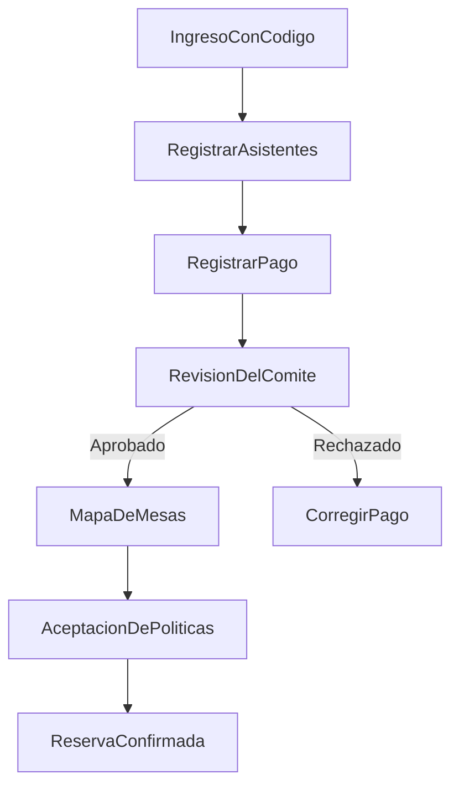
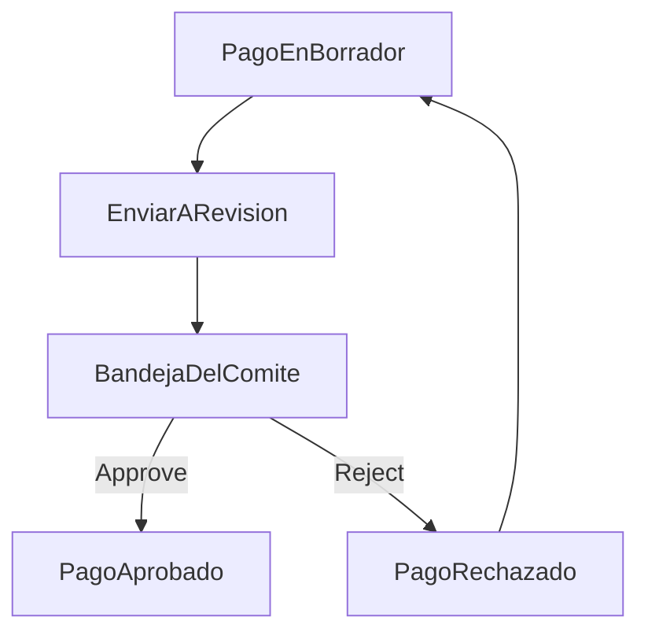
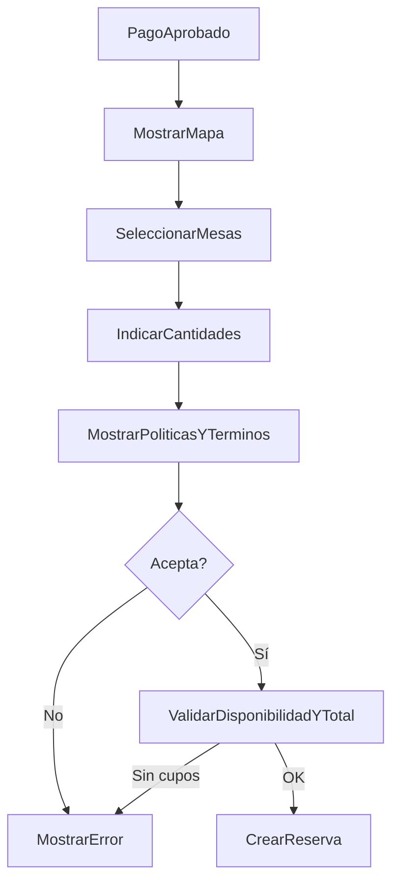

# UX/UI y flujos de pantalla — Reserva de cupos en mesas

Documento alineado con las etapas 1 a 4 y con la línea base `código -> asistentes -> pago -> aprobación -> reserva`.

---

## 1. Arquitectura de información

### Perfil comprador

```text
Acceso por código
└── Mi proceso
    ├── Estado general
    ├── Asistentes
    ├── Pago y evidencias
    ├── Estado de revisión
    ├── Mapa y reserva
    └── Mi reserva
```

### Perfil comité

```text
Panel staff
├── Eventos
├── Importación de estudiantes
├── Layout y mesas
├── Pagos en revisión
├── Reservas
└── Auditoría
```

### Principios de experiencia

- El usuario siempre debe entender en qué paso va.
- El mapa no debe generar falsas expectativas antes de la aprobación del pago.
- Las pantallas del comité deben priorizar velocidad operativa y trazabilidad.
- La terminología visible debe ser simple: `asistentes`, `pago`, `en revisión`, `aprobado`, `mesa`, `cupos reservados`.
- Si el código ya fue utilizado en el evento, la interfaz debe reabrir el proceso existente y comunicar que se retomó su estado.

### Ruteo y segmentación por rol

- La solución debe operar con **una sola SPA**.
- Rutas públicas/cliente bajo `/portal/*` para comprador.
- Rutas internas bajo `/staff/*` para comité.
- Guards obligatorios por rol (`buyer`, `staff`) y por ámbito de evento (`eventId`) antes de cargar vistas sensibles.

---

## 2. Mapa de pantallas

| ID | Pantalla | Actor | Objetivo |
|----|----------|-------|----------|
| S-001 | Acceso por código | Comprador | Ingresar con `codigo_estudiante` |
| S-002 | Estado del proceso | Comprador | Ver resumen del avance |
| S-003 | Registro de asistentes | Comprador | Crear y editar asistentes |
| S-004 | Registro de pago | Comprador | Registrar boletas, tipo de pago y evidencia |
| S-005 | Pago en revisión | Comprador | Ver estado y observaciones del comité |
| S-006 | Mapa de mesas | Comprador | Reservar cupos tras aprobación |
| S-007 | Confirmación de políticas | Comprador | Aceptar política de datos y términos antes de reservar |
| S-008 | Confirmación de reserva | Comprador | Consultar códigos de reserva y mesas asignadas |
| S-010 | Dashboard del evento | Comité | Ver indicadores y accesos rápidos |
| S-011 | Importación de estudiantes | Comité | Cargar CSV o Excel |
| S-012 | Configuración del evento | Comité | Etapas, topes, layout y datos del lugar |
| S-013 | Bandeja de pagos | Comité | Aprobar, rechazar o registrar pagos |
| S-014 | Mapa operativo | Comité | Revisar ocupación y estado global |
| S-015 | Ajustes manuales | Comité | Corregir pagos o reservas |
| S-016 | Políticas del evento | Comité | Administrar política y términos vigentes |
| S-017 | Auditoría | Comité | Consultar trazabilidad |

---

## 3. Flujos principales por actor

### 3.1 Comprador

1. Ingresa con su código.
2. Diligencia asistentes.
3. Registra el pago.
4. Espera la revisión del comité.
5. Si el pago es aprobado, accede al mapa.
6. Acepta la política de datos y los términos del evento.
7. Reserva cupos y recibe códigos de reserva por asistente.
8. Cuando vuelve a ingresar, puede consultar nuevamente la versión exacta de las políticas y términos aceptados.

### 3.2 Comité organizador

1. Configura evento y layout.
2. Importa estudiantes.
3. Revisa pagos.
4. Aprueba, rechaza o corrige.
5. Supervisa reservas y mapa.
6. Interviene manualmente cuando hace falta.

### Diagrama general



---

## 4. Flujo de registro de asistentes

### Paso a paso

1. El usuario entra al módulo `Asistentes`.
2. Agrega uno o varios asistentes.
3. Completa nombres, apellidos, tipo y número de documento, vegetariano, alergias, número celular, contacto de emergencia y movilidad reducida.
4. El sistema valida campos obligatorios y la ventana temporal de edición.
5. El usuario guarda y avanza.

### Wireframe textual

```text
+--------------------------------------------------------------+
| Registrar asistentes                                         |
+--------------------------------------------------------------+
| Asistente 1                                                  |
| Nombres [____________]  Apellidos [____________]             |
| Tipo doc [____]  Documento [____________]                    |
| Vegetariano [Sí/No]  Movilidad reducida [Sí/No]             |
| Celular [____________]                                       |
| Alergias [______________________________________________]    |
| Contacto emergencia [____________________] Tel [__________]  |
|                                                              |
| [Agregar asistente]                                          |
| [Guardar borrador]                         [Continuar]        |
+--------------------------------------------------------------+
```

### Componentes sugeridos

- formulario repetible,
- selector binario para vegetariano,
- selector binario para movilidad reducida,
- validación inline,
- guardado de borrador,
- banner de bloqueo cuando falten 20 días o menos para el evento.

---

## 5. Flujo de pago y revisión del comité

### Flujo comprador

1. El usuario indica cuántas boletas compró.
2. El sistema valida el máximo según etapa.
3. El usuario elige tipo de pago.
4. Si el pago es digital, adjunta comprobante.
5. Si el pago es en efectivo, la UI informa que la evidencia será registrada por el comité mediante foto del recibo de caja.
6. Envía el pago a revisión.
7. La pantalla cambia a `En revisión`.

### Flujo comité

1. El comité abre la bandeja de pagos.
2. Revisa cantidad, evidencia y datos del grupo.
3. Aprueba o rechaza.
4. El sistema actualiza el estado del comprador.

### Diagrama Mermaid



### Wireframe textual comprador

```text
+--------------------------------------------------------------+
| Registrar pago                                               |
+--------------------------------------------------------------+
| Etapa actual: Preventa                                       |
| Máximo permitido: 4 boletas                                  |
| Cantidad [ 3 ]                                               |
| Tipo de pago [Digital v]                                     |
| Comprobante [Subir archivo]                                  |
|                                                              |
| [Guardar borrador]                      [Enviar a revisión]  |
+--------------------------------------------------------------+
```

### Wireframe textual comité

```text
+-------------------------------------------------------------------+
| Bandeja de pagos                                                  |
+-------------------------------------------------------------------+
| Grupo         | Boletas | Tipo     | Estado    | Acción           |
| Familia Ruiz  | 3       | Digital  | Pendiente | [Ver] [Aprobar] |
| Familia León  | 2       | Efectivo | Pendiente | [Ver] [Rechazar]|
+-------------------------------------------------------------------+
```

---

## 6. Flujo de reserva de cupos en mesa

### Reglas UX

- El mapa permanece bloqueado hasta `APPROVED`.
- El usuario selecciona una o varias mesas, no una silla.
- El usuario indica cuántos cupos reservará en cada mesa.
- La UI debe mostrar siempre `disponibles / capacidad`.
- La UI debe mostrar el total de cupos distribuidos respecto al total aprobado.

### Flujo

1. El comprador entra al mapa.
2. Ve mesas con estados agregados.
3. Selecciona una o varias mesas.
4. El sistema muestra los cupos libres por mesa.
5. El comprador indica la cantidad por mesa.
6. El sistema presenta la política de tratamiento de datos y los términos y condiciones vigentes.
7. El comprador marca la aceptación explícita.
8. El backend confirma o rechaza toda la operación por disponibilidad y consentimiento.
9. Si se confirma, se muestran los códigos secuenciales por asistente y el resumen por mesa.

### Wireframe textual

```text
+------------------------------------------------------------------+
| Seleccionar mesa                                                 |
+------------------------------------------------------------------+
| Estado del pago: Aprobado                                        |
| Boletas aprobadas: 3                                             |
|                                                                  |
| [Mapa del evento]                                                |
| Mesa M01  7/10 disponibles                                       |
| Mesa M02  2/10 disponibles                                       |
| Mesa M03  0/10 disponibles                                       |
|                                                                  |
| Mesas seleccionadas: M01 [2]  M02 [1]                            |
| Total asignado: 3/3                                              |
| Mesa seleccionada 1 puestos 2                                    |
| Mesa seleccionada 5 puestos 1                                    |
| [ ] Acepto política de datos y términos del evento               |
|                                              [Confirmar reserva] |
+------------------------------------------------------------------+
```

### Diagrama Mermaid



---

## 7. Flujo de intervención manual del organizador

### Escenarios

- registrar pago en efectivo,
- corregir una cantidad aprobada,
- mover una reserva,
- ajustar cupos por excepción,
- revisar una reserva.

### Flujo

1. El comité ubica al grupo.
2. Abre el detalle de pago o reserva.
3. Ejecuta la acción permitida.
4. El sistema valida consistencia.
5. La acción queda registrada en auditoría.

### Wireframe textual

```text
+------------------------------------------------------------------+
| Ajuste manual                                                    |
+------------------------------------------------------------------+
| Grupo: Familia Ruiz                                              |
| Pago: Approved - 3 boletas                                       |
| Reserva: M01 [2] / M02 [1]                                       |
|                                                                  |
| [Registrar efectivo] [Mover reserva] [Corregir pago] [Auditar]   |
+------------------------------------------------------------------+
```

---

## 8. Estados de UI

| Estado | Etiqueta visible | Comportamiento |
|--------|------------------|----------------|
| Código inválido | `Código no válido` | Bloquea acceso |
| Asistentes incompletos | `Faltan datos` | No deja avanzar al pago |
| Pago en borrador | `Borrador` | Editable |
| Pago en revisión | `En revisión` | Solo lectura para el comprador |
| Pago aprobado | `Aprobado` | Habilita mapa |
| Políticas pendientes | `Debes aceptar las políticas` | Bloquea la confirmación de reserva |
| Pago rechazado | `Rechazado` | Permite corregir y reenviar |
| Mesa disponible | `Disponible` | Seleccionable |
| Mesa parcialmente ocupada | `Cupos limitados` | Seleccionable según disponibilidad |
| Mesa llena | `Sin disponibilidad` | No seleccionable |
| Reserva creada | `Reserva confirmada` | Muestra códigos por asistente y distribución de mesas |
| Restringido | `Acción no disponible` | Explica por qué no puede continuar |

### Reglas visuales para el mapa

- Verde: mesa con buena disponibilidad.
- Amarillo: mesa con pocos cupos.
- Rojo: mesa llena.
- Gris: mesa no seleccionable públicamente.
- Tarima y pista: elementos decorativos no interactivos.
- Cada mesa debe mostrar su código y cupos disponibles.

---

## 9. Recomendaciones de usabilidad

- Mostrar el proceso como un stepper claro.
- Explicar siempre por qué una acción está bloqueada.
- Mantener el formulario de pago editable hasta aprobación.
- Mostrar explícitamente hasta cuándo el comprador puede editar asistentes.
- Mostrar resumen claro de la política y términos antes de confirmar, con acceso al texto completo y versión vigente.
- Usar mensajes accionables en rechazo del pago.
- Evitar terminología técnica como `APPROVED` o `reservation_status` en la UI pública.
- Hacer el mapa usable en móvil con tarjetas o bottom sheet para detalle de mesa.
- Mantener la bandeja del comité optimizada para revisión rápida.

### Componentes UI sugeridos

- `Stepper`
- `DataTable`
- `Drawer`
- `BottomSheet`
- `MapCanvas`
- `InlineAlert`
- `StatusBadge`
- `FileUploader`

### Responsive

- Desktop: mapa con panel lateral y tablas completas.
- Tablet: paneles colapsables y mapa central.
- Móvil: flujo secuencial, formularios apilados y detalle de mesa en modal o bottom sheet.

---

## 10. Riesgos UX críticos

| Riesgo | Impacto | Mitigación |
|--------|---------|------------|
| El usuario cree que puede elegir mesa antes del pago aprobado | Frustración | Bloqueo explícito con copy claro |
| El comité tarda en revisar y el usuario no entiende el estado | Soporte innecesario | Pantalla de estado con mensajes y fecha de actualización |
| El mapa es confuso en móvil | Errores de reserva | Simplificar interacción y usar selección guiada |
| El rechazo del pago no explica la causa | Reproceso lento | Motivo visible y CTA para corregir |
| Una reserva falla por concurrencia y parece bug | Pérdida de confianza | Mensaje empático y refresco de disponibilidad |

---

## 11. Otros flujos detectados

- Reingreso del comprador para consultar su reserva.
- Reingreso del comprador con código ya utilizado para consultar su proceso existente.
- Reenvío de pago rechazado.
- Solicitud informativa de cancelación o devolución derivada al administrador de la plataforma.
- Gestión y publicación de política de tratamiento de datos y términos por parte del comité.
- Reconsulta posterior de la versión legal aceptada junto con la reserva.
- Carga masiva de estudiantes con errores parciales.
- Revisión posterior del comité sobre reservas ya creadas.
- Bloqueo de edición de asistentes cuando faltan 20 días o menos para el evento.
- Visualización de códigos individuales por asistente en reservas multi-mesa.
- Cierre del evento en modo solo lectura.

---

Este documento reemplaza el diseño anterior basado en sillas, `HOLD` y checkout. La UX oficial del MVP gira en torno a estado del proceso, aprobación manual y reserva por cupos.
