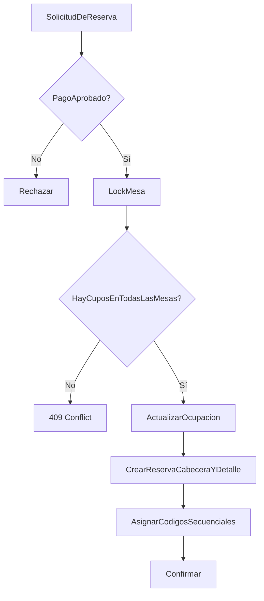

# Motor de layout y asignación de cupos — Diseño conceptual

Documento alineado con la línea base del MVP sin `Seat` ni `HOLD`.

---

## 1. Modelo conceptual del layout del salón

El motor se divide en dos partes:

- **Motor de layout:** modela el espacio físico del evento.
- **Motor de asignación:** valida y persiste reservas de cupos por mesa.

El layout es una escena 2D versionada compuesta por:

- límites del salón,
- zonas,
- elementos fijos,
- mesas,
- metadatos visuales.

La asignación no opera por sillas, sino por un contador de cupos disponibles dentro de cada mesa. Una sola operación de reserva puede distribuir cupos entre varias mesas si el pago ya fue aprobado.

---

## 2. Representación del espacio

### 2.1 Dimensiones del salón

- `boundary` o contenedor principal del salón.
- Sistema de coordenadas 2D.
- Metadatos opcionales de escala.

### 2.2 Zonas

- polígonos o rectángulos lógicos,
- nombres de sector,
- bandera `is_public_selectable`.

### 2.3 Tarima y pista

- entidades de tipo `FixedFeature`,
- no reservables,
- visibles en el mapa para orientación.

### 2.4 Mesas

Cada mesa debe incluir:

- `code`,
- posición,
- rotación,
- geometría,
- `table_capacity_limit`,
- `current_occupied_spots`,
- visibilidad pública.

### 2.5 Restricciones de circulación

- áreas no ocupables,
- límites del plano,
- restricciones de colocación para el editor.

---

## 3. Estrategias para crear el layout

### 3.1 Manual

Editor visual para ubicar mesas, zonas y elementos fijos.

### 3.2 Basado en plantillas

Layouts preconfigurados que luego se ajustan por evento.

### 3.3 Desde imagen o foto

Una imagen de referencia sirve como fondo visual para ubicar mesas.

### 3.4 Edición posterior

Se recomienda versionar el layout y enlazar el evento a una revisión concreta, evitando mutaciones estructurales una vez abierto al público.

---

## 4. Disponibilidad por mesa

La disponibilidad se calcula así:

`available_spots = table_capacity_limit - current_occupied_spots`

Estados operativos recomendados:

- `AVAILABLE`
- `LIMITED`
- `FULL`
- `BLOCKED`

El cliente solo consume la proyección de disponibilidad; la fuente de verdad vive en backend.

---

## 5. Reglas de asignación por grupo

- Un grupo solo puede reservar si tiene un pago `APPROVED`.
- Un grupo solo puede reservar si existe aceptación válida de política de tratamiento de datos y términos del evento para esa operación.
- La cantidad a reservar no puede exceder las boletas aprobadas disponibles.
- La cantidad solicitada no puede exceder los cupos disponibles de cada mesa involucrada.
- Si la reserva toca varias mesas, toda la operación debe confirmarse o rechazarse en bloque.
- El organizador puede intervenir manualmente sin violar capacidad.
- La reserva exitosa genera códigos secuenciales por asistente dentro del evento.

---

## 6. Cómo evitar inconsistencias por concurrencia

La reserva debe ejecutarse en una transacción única.

Patrón recomendado:

1. Bloquear todas las filas de `LayoutTable` involucradas en orden estable.
2. Leer `table_capacity_limit` y `current_occupied_spots`.
3. Validar disponibilidad de cada mesa y total del grupo.
4. Actualizar ocupación.
5. Insertar la reserva cabecera y sus `TableReservation`.
6. Asignar códigos secuenciales por asistente.
7. Confirmar la transacción.

Si la disponibilidad ya no alcanza, se devuelve un conflicto.

---

## 7. Estrategia de bloqueo transaccional

Se recomienda:

- `SELECT ... FOR UPDATE` sobre las filas de las mesas,
- orden fijo de adquisición de locks para soportar multi-mesa,
- error explícito cuando la reserva ya no puede completarse.

No se recomienda introducir bloqueos temporales del inventario en el MVP.

---

## 8. Estrategia de liberación y reasignación

### Liberación

- cambia el estado de la reserva,
- itera todas las filas de `TableReservation` asociadas,
- recalcula ocupación por mesa en la misma transacción,
- deja auditoría,
- no procesa devoluciones ni cancelaciones de pago dentro de la aplicación.

### Reasignación

Puede modelarse como:

1. liberar reserva previa,
2. crear nueva reserva,
3. registrar trazabilidad.

La corrección manual del comité no debe regenerar los códigos ya asignados a los asistentes.

Si el comité hace un ajuste manual, debe pasar por la misma validación de capacidad.

---

## 9. Enfoque técnico para validar capacidad y ocupación

### Regla de escritura

Para una solicitud `reserve_table_spots(allocations[], group_id)`:

1. validar pago aprobado del grupo,
2. validar aceptación de política y términos vigentes,
3. validar cupos de boletas aprobadas restantes,
4. bloquear todas las mesas involucradas,
5. calcular cupos libres por mesa,
6. rechazar si cualquier asignación supera los libres,
7. incrementar ocupación por mesa,
8. crear reserva cabecera, detalle y consentimiento,
9. asignar códigos secuenciales por participante.

Complejidad O(n) respecto al número de mesas involucradas.

---

## 10. Backend vs frontend

| Decisión | Backend | Frontend |
|----------|---------|----------|
| Capacidad real y ocupación | Sí | No |
| Elegibilidad por pago aprobado | Sí | Solo mostrar estado |
| Consentimiento legal previo | Sí | Captura visual y envío de confirmación |
| Validación de cantidad de cupos | Sí | Validación previa opcional |
| Proyección del mapa | Sí | Render |
| Interacción visual del layout | No | Sí |
| Concurrencia | Sí | Manejo del error |

Regla general: todo lo que afecte inventario o reglas de negocio vive en backend.

---

## 11. Riesgos técnicos y operativos

| Riesgo | Impacto | Mitigación |
|--------|---------|------------|
| Sobreocupación por concurrencia | Crítico | Lock pesimista por mesa |
| Desfase entre contador y reservas | Alto | Actualización transaccional y reconciliación |
| Layout modificado con evento activo | Alto | Binding por versión |
| Reserva manual inconsistente | Medio | Misma validación del backend y auditoría |
| Mapa pesado en móvil | Medio | Proyección simplificada y UX guiada |

---

## 12. Modelo de objetos propuesto

```text
Vec2 { x, y }
Rect2D { x, y, width, height, rotation }
Polygon2D { vertices[] }

LayoutDocument {
  id
  version
  boundary
  background_image_url
  zones[]
  fixed_features[]
  tables[]
}

Zone {
  id
  name
  geometry
  is_public_selectable
}

FixedFeature {
  id
  type
  label
  geometry
}

LayoutTable {
  id
  code
  geometry
  rotation
  table_capacity_limit
  current_occupied_spots
  is_public_selectable
}

ReservationAllocation {
  layout_table_id
  spots
}

ReserveTableSpotsCommand {
  event_id
  attendee_group_id
  allocations[]
  payment_id
}

ReleaseReservationCommand {
  event_id
  reservation_id
  reason
}
```

---

## 13. Pseudocódigo del proceso

### 13.1 Reserva

```text
function reserve_table_spots(cmd, db):
  begin transaction

  payment = load_payment_for_update(cmd.payment_id)
  assert payment.status == APPROVED

  group = load_group_for_update(cmd.attendee_group_id)
  assert cmd.policy_terms_accepted == true
  assert current_event_policy_versions_exist(cmd.event_id)
  reserved_spots = count_reserved_spots(group.id)
  total_requested = sum(cmd.allocations.spots)
  assert reserved_spots + total_requested <= group.approved_ticket_count

  tables = load_tables_for_update(sorted(cmd.allocations.layout_table_id))
  for each allocation in cmd.allocations:
    available = table_capacity_limit - current_occupied_spots
    assert allocation.spots <= available

  reservation = insert reservation(...)
  insert reservation_consent(...)

  for each allocation in cmd.allocations:
    update layout_table
      set current_occupied_spots = current_occupied_spots + allocation.spots

    insert table_reservation(
      reservation_id,
      event_id,
      attendee_group_id,
      layout_table_id,
      payment_id,
      spots_reserved,
      status
    )

  assign_sequential_codes_to_participants(reservation.id)

  commit
  return reservation.id
```

### 13.2 Liberación

```text
function release_reservation(reservation_id, db):
  begin transaction

  reservation = load_reservation_for_update(reservation_id)
  rows = load_table_reservations_for_update(reservation_id)
  table_ids = sorted(distinct(rows.layout_table_id))
  tables = load_tables_for_update(table_ids)

  update table_reservation
    set status = RELEASED
    where reservation_id = reservation_id

  for each row in rows:
    update layout_table
      set current_occupied_spots = current_occupied_spots - row.spots_reserved
      where id = row.layout_table_id

  recalculate_occupancy_for_tables(table_ids)
  write_audit_log("TABLE_RESERVATION_RELEASED", reservation_id, rows)

  commit
```

### 13.3 Ajuste manual

```text
function move_reservation(reservation_id, new_allocations, db):
  begin transaction
  release_reservation_locked(reservation_id)
  reserve_table_spots_locked(new_allocations)
  commit
```

---

## 14. Diagrama Mermaid del proceso



---

El backend oficial del MVP opera con `LayoutTable`, `current_occupied_spots` y `TableReservation`.
