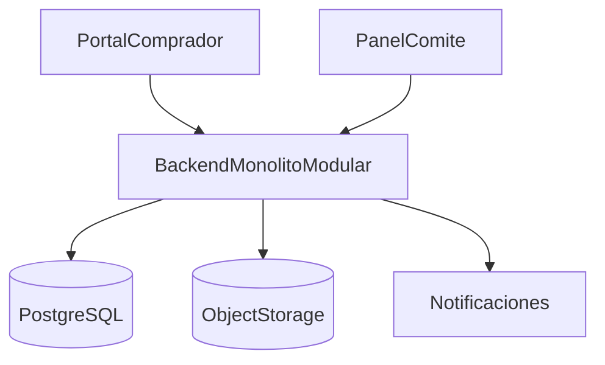

# Arquitectura técnica — Reserva de cupos en mesas

Documento alineado con el MVP de importación de estudiantes, pagos externos con revisión manual y reserva por cupos.

---

## 1. Propuesta de arquitectura de alto nivel

La solución debe implementarse como un **monolito modular** con:

- un solo frontend SPA segmentado por rutas y guards,
- backend transaccional,
- base de datos relacional,
- almacenamiento de archivos,
- servicios auxiliares de auditoría y notificación.

Esta elección favorece:

- transacciones consistentes,
- menor complejidad operativa,
- salida rápida a producción,
- evolución posterior sin reescribir el dominio.

### Diagrama de arquitectura

---

## 2. Componentes principales

| Componente | Descripción |
|------------|-------------|
| Portal comprador | UI del estudiante o familia |
| Panel comité | UI operativa del staff |
| API de aplicación | Exposición de casos de uso y reglas |
| Módulo de importación | Procesa CSV o Excel de estudiantes con tres columnas cerradas |
| Módulo de autenticación | Valida acceso por código y acceso staff |
| Módulo de asistentes | Gestiona participantes del grupo y ventana de edición |
| Módulo de pagos | Crea, revisa y actualiza pagos |
| Módulo legal | Administra políticas y términos del evento |
| Módulo de layout | Mantiene mapa, mesas y configuración espacial |
| Módulo de reservas | Valida disponibilidad y crea reservas multi-mesa |
| Módulo de códigos | Asigna secuencias individuales por asistente dentro del evento |
| Módulo de auditoría | Registra acciones críticas |
| Storage | Guarda comprobantes y evidencias |

---

## 3. Responsabilidad de cada componente

| Componente | Responsabilidad |
|------------|-----------------|
| Importación | Validar y cargar padrón de estudiantes |
| Autenticación | Resolver acceso por código, su unicidad por evento y roles internos |
| Asistentes | Gestionar datos obligatorios por participante y aplicar la regla de edición hasta 20 días antes del evento |
| Pagos | Manejar estados `DRAFT`, `PENDING_APPROVAL`, `APPROVED`, `REJECTED` |
| Legal | Gestionar CRUD, publicación y versionado de política y términos; registrar aceptación en la reserva |
| Layout | Exponer geometría y disponibilidad de mesas |
| Reservas | Ejecutar reserva transaccional multi-mesa y liberar o mover cuando aplique |
| Códigos | Emitir y persistir códigos correlativos por asistente sin regenerarlos en correcciones manuales |
| Auditoría | Guardar trazabilidad de cambios |
| Notificaciones | Informar cambios relevantes al usuario |

---

## 4. Propuesta de frontend

### Comprador

- Módulo dentro de la SPA bajo `/portal/*`.
- Flujo guiado tipo stepper.
- Mapa simplificado por mesa.
- Componentes de formulario, carga de archivos y estados.

### Comité

- Módulo dentro de la SPA bajo `/staff/*`.
- Mapa operativo con panel lateral.
- Bandeja de pagos y ajustes manuales.

### Trade-off

Un solo frontend con rutas segmentadas reduce duplicación. Dos aplicaciones separadas dan más aislamiento, pero agregan costo de mantenimiento.

Para MVP se recomienda una sola base frontend con separación por módulos y permisos.

Guards mínimos:

- guard de autenticación por tipo de sesión (comprador/staff),
- guard de autorización por rol,
- guard de alcance por `eventId` para acceso a recursos del evento.

---

## 5. Propuesta de backend

Se recomienda una API REST versionada con módulos internos:

- `AuthModule`
- `StudentImportModule`
- `EventModule`
- `LayoutModule`
- `AttendeeModule`
- `PaymentModule`
- `LegalModule`
- `ReservationModule`
- `ReservationCodeModule`
- `AuditModule`

### Enfoque

- capa de controladores,
- capa de casos de uso,
- capa de dominio,
- capa de persistencia.

### Justificación

El dominio necesita operaciones consistentes entre pagos, grupos y reservas. Un backend modular permite separar responsabilidades sin dividir despliegues prematuramente.

---

## 6. Base de datos recomendada

**PostgreSQL** es la opción principal por:

- soporte ACID,
- locks pesimistas,
- constraints y FKs sólidas,
- buen soporte para JSONB y reportes operativos,
- madurez para aplicaciones OLTP.

---

## 7. Mecanismo de autenticación y autorización

### Comprador

- acceso por `codigo_estudiante`,
- sesión acotada al evento o grupo,
- control de reingreso sobre el mismo grupo.

### Staff

- autenticación clásica con email y contraseña o proveedor OIDC,
- autorización por rol y pertenencia al evento.

### Modelo recomendado

- comprador: autenticación específica del dominio,
- staff: RBAC tradicional.

---

## 8. Módulo de pagos y validación manual

El módulo de pagos debe soportar:

- creación de pago por comprador,
- evidencias documentales,
- bandeja de revisión,
- registro de pagos en efectivo por staff,
- aprobación o rechazo manual.

### Almacenamiento de evidencias

Se recomienda object storage con URLs firmadas o controladas por backend.

### Trade-off

La revisión manual simplifica la integración inicial pero exige mejor soporte operativo y trazabilidad.

---

## 9. Estrategia de concurrencia y consistencia

La concurrencia crítica ocurre en la reserva de cupos de una o varias mesas dentro de una sola operación.

### Patrón recomendado

1. abrir transacción,
2. bloquear todas las filas `layout_table` implicadas en orden estable,
3. recalcular disponibilidad,
4. validar cantidad solicitada por mesa y total del grupo,
5. validar documentos legales vigentes y consentimiento,
6. crear reserva cabecera y detalle,
7. actualizar contadores,
8. asignar códigos secuenciales por asistente,
9. confirmar transacción.

### Justificación

Es más simple y consistente que diseñar mecanismos distribuidos para el MVP.

---

## 10. Auditoría y trazabilidad

Debe registrarse al menos:

- importaciones de estudiantes,
- accesos por código,
- creación y envío de pagos,
- aprobación o rechazo,
- publicación de política y términos del evento,
- creación, ajuste o liberación de reservas,
- asignación de códigos secuenciales por asistente,
- aceptación legal de la reserva,
- acciones manuales del comité.

La auditoría debe incluir:

- actor,
- entidad,
- acción,
- fecha,
- payload resumido,
- correlación de request.

---

## 11. Estrategia de notificaciones

MVP recomendado:

- notificaciones in-app,
- correo para cambios importantes si el negocio lo requiere.

Eventos relevantes:

- pago rechazado,
- pago aprobado,
- actualización de política o términos cuando afecte el proceso de reserva,
- reserva creada,
- bloqueo de edición de asistentes al entrar en la ventana de 20 días,
- ajuste manual del comité.

Las notificaciones deben ser asíncronas respecto a la transacción principal.

---

## 12. Observabilidad y monitoreo

Se recomienda:

- logs estructurados,
- métricas por evento,
- trazas de operaciones críticas,
- alertas sobre errores en importación, aprobación y reservas.

Métricas mínimas:

- pagos pendientes,
- pagos rechazados,
- reservas creadas,
- conflictos de concurrencia,
- ocupación por evento.

---

## 13. Riesgos técnicos

| Riesgo | Impacto | Mitigación |
|--------|---------|------------|
| Concurrencia en reservas | Alto | Lock pesimista por mesa |
| Mala calidad del archivo importado | Medio | Validación fuerte y reportes de error |
| Evidencias pesadas o inválidas | Medio | Restricción de formatos y tamaño |
| Cambios manuales sin trazabilidad | Alto | Auditoría obligatoria |
| Desacople entre ocupación y reservas | Alto | Transacciones y reconciliación |
| Colisión en secuencias de códigos | Alto | Asignación transaccional por evento con unicidad estricta |

---

## 14. Recomendación para MVP

Se recomienda:

1. Monolito modular.
2. PostgreSQL.
3. Frontend web responsive.
4. Object storage para evidencias.
5. Login comprador por código.
6. Flujo manual de aprobación de pagos.
7. Reserva transaccional multi-mesa.
8. Secuencias correlativas por asistente.

No se recomienda para MVP:

- microservicios,
- pasarela de pago integrada como dependencia crítica,
- inventario por silla,
- workers complejos de expiración de hold.

---

## 15. Roadmap técnico evolutivo

| Fase | Evolución |
|------|-----------|
| MVP | Importación, acceso, asistentes, pagos, reservas |
| Fase 2 | Notificaciones y mejores reportes |
| Fase 3 | Integraciones externas y automatizaciones |
| Fase 4 | Multi-salón, multi-evento y hardening operativo |

### Monolito modular vs microservicios

**Monolito modular** es mejor cuando:

- el equipo es pequeño,
- el dominio aún está madurando,
- se necesita consistencia fuerte,
- el time-to-market es crítico.

**Microservicios** solo deberían evaluarse después, si:

- el volumen justifica escalado independiente,
- existen equipos separados por dominio,
- hay cuellos de botella medidos.

---

## Stack tecnológico sugerido

| Capa | Opción recomendada |
|------|--------------------|
| Frontend | React o Vue |
| Backend | NestJS, FastAPI, ASP.NET Core o Spring Boot |
| DB | PostgreSQL |
| Storage | S3, Azure Blob o equivalente |
| Observabilidad | OpenTelemetry + plataforma de logs |

La elección exacta debe alinearse con el stack dominante del equipo.

---

Esta arquitectura reemplaza el diseño previo centrado en `Seat`, webhooks como eje principal y workers de expiración de `HOLD`. La línea base técnica vigente es importación, aprobación manual y reserva por mesa con consistencia fuerte.
