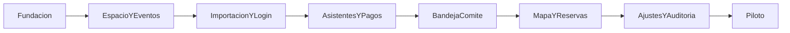

# Plan de desarrollo — MVP reserva de cupos en mesas

Documento alineado con el marco funcional y técnico vigente.

---

## Resumen ejecutivo

El MVP debe construirse alrededor de un flujo corto y verificable:

1. importar estudiantes,
2. ingresar con código de un solo uso por evento,
3. registrar asistentes,
4. registrar pago externo,
5. administrar y publicar política y términos del evento,
6. aprobar o rechazar desde comité,
7. reservar cupos por una o varias mesas con aceptación legal obligatoria.

Los frameworks **PLAN** y **ORDEN** se usan para asegurar foco, secuencia lógica y entregas incrementales.

---

## Framework PLAN

| Letra | Significado | Aplicación |
|-------|-------------|------------|
| P | Propósito | Cada épica debe acercar al flujo completo del MVP |
| L | Límites | Mantener fuera funcionalidades no esenciales |
| A | Artefactos | Usar como base los documentos 1 a 8 ya alineados |
| N | Nivel de hecho | No declarar listo un módulo sin validación funcional mínima |

## Framework ORDEN

| Letra | Significado | Aplicación |
|-------|-------------|------------|
| O | Orden | Construir primero base de datos, APIs y flujo crítico |
| R | Ruta crítica | Priorizar pagos, aprobación y reservas |
| D | Delivery vertical | Entregar slices funcionales de punta a punta |
| E | Encaje | Coordinar frontend, backend y QA sobre contratos |
| N | No deuda oculta | No avanzar dejando inconsistencias de dominio sin cerrar |

---

## 1. Propósito del proyecto

Construir un MVP que permita operar un evento real con control de estudiantes, asistentes, pagos y reservas de mesas, reduciendo fricción para familias y carga manual para el comité.

---

## 2. Lista de épicas y tareas

### Épica E0 — Fundación

- repositorio, CI y ambientes,
- base de datos,
- autenticación staff,
- base de API,
- storage para evidencias.

### Épica E1 — Espacio y eventos

- CRUD de salones,
- layouts y mesas,
- configuración del evento con fechas y geolocalización,
- binding layout-evento.

### Épica E2 — Base de compradores

- importación de estudiantes,
- login por código de un solo uso por evento,
- creación automática o inicialización del grupo comprador.

### Épica E3 — Asistentes y pagos

- formularios de asistentes,
- regla de edición hasta 20 días antes del evento,
- CRUD de política de datos y términos del evento,
- creación de pagos,
- carga de evidencias,
- envío a revisión.

### Épica E4 — Comité y conciliación

- bandeja de pagos,
- aprobación y rechazo,
- registro de pagos en efectivo con foto del recibo de caja,
- auditoría de decisiones.

### Épica E5 — Reservas

- mapa del evento,
- disponibilidad por mesa,
- aceptación obligatoria de política y términos,
- reserva transaccional multi-mesa,
- visualización clara de distribución multi-mesa,
- códigos secuenciales por asistente,
- liberación o movimiento controlado.

### Épica E6 — Operación y calidad

- ajustes manuales del comité,
- métricas y observabilidad,
- pruebas integrales,
- hardening previo al piloto.

---

## 3. Asignación de roles recomendados

| Rol | Responsabilidad |
|-----|-----------------|
| Tech Lead | Asegurar coherencia arquitectónica y priorización |
| Backend | API, modelo de datos, pagos, reservas |
| Frontend | Portal comprador y panel comité |
| QA | Estrategia de calidad y validación end-to-end |
| Product Owner | Cierre de decisiones funcionales |
| Delivery Manager | Seguimiento, dependencias y ritmo de entrega |

---

## 4. Necesidades de equipo, herramientas y ambientes

### Equipo mínimo recomendado

- 1 Tech Lead
- 2 Backend
- 1 Frontend
- 1 QA compartido
- 1 Product Owner disponible

### Herramientas

- gestor de tareas,
- repositorio Git,
- CI/CD,
- PostgreSQL,
- object storage,
- ambiente `dev`, `staging` y `prod`.

---

## 5. Orden secuencial de implementación

1. Fundación técnica.
2. Layout, mesas y eventos.
3. Importación de estudiantes y login por código.
4. Asistentes y pagos.
5. Bandeja del comité.
6. Mapa y reservas.
7. Ajustes manuales y auditoría.
8. Hardening y piloto.

### Diagrama

---

## 6. Dependencias

| Dependencia | Bloquea |
|-------------|---------|
| Layout configurado | Mapa y reservas |
| Configuración de etapas | Validación de pagos |
| Importación de estudiantes | Login por código |
| Pago aprobado | Reserva por mesa |
| API de mapa | Frontend comprador |
| Auditoría | Operación final y soporte |

---

## 7. Hitos

| Hito | Resultado |
|------|-----------|
| H1 | Plataforma base operativa |
| H2 | Layout, mesas y eventos configurables |
| H3 | Estudiantes importados y login por código |
| H4 | Registro de asistentes y pagos |
| H5 | Bandeja de aprobación del comité |
| H6 | Reserva por mesa con código único |
| H7 | Ajustes manuales y auditoría |
| H8 | Staging estable listo para piloto |

---

## 8. Riesgos

| Riesgo | Impacto | Mitigación |
|--------|---------|------------|
| Requisitos cambian a mitad del build | Alto | Mantener límites claros del MVP |
| Mala calidad del padrón de estudiantes | Medio | Validación fuerte en importación |
| Cuello de botella en revisión manual | Medio | UX operativa eficiente para comité |
| Concurrencia en reservas | Alto | Implementación transaccional temprana |
| Colisión en códigos secuenciales por asistente | Alto | Diseño temprano de secuencia transaccional por evento |
| Rechazos mal comunicados | Medio | Mensajes claros y trazabilidad |

---

## 9. Cronograma tentativo por semanas

| Semana | Foco |
|--------|------|
| 1 | Fundación técnica |
| 2 | Salones, layouts y mesas |
| 3 | Eventos y configuración |
| 4 | Importación de estudiantes |
| 5 | Login por código y grupos |
| 6 | Asistentes y pagos |
| 7 | Bandeja del comité |
| 8 | Mapa de mesas |
| 9 | Reservas transaccionales |
| 10 | Ajustes manuales y auditoría |
| 11 | QA integral |
| 12 | Hardening y piloto |

---

## 10. Qué debe entrar al MVP y qué debe quedar fuera

### Dentro del MVP

- importación CSV o Excel,
- acceso por código,
- asistentes con datos obligatorios,
- edición de asistentes hasta 20 días antes del evento,
- pago digital y efectivo,
- bandeja de aprobación,
- mapa con mesas,
- reserva por cupos incluso multi-mesa,
- códigos correlativos por asistente,
- auditoría básica.

### Fuera del MVP

- reservas por silla,
- pre-reservas temporales,
- pasarela de pago integrada como dependencia principal,
- microservicios,
- analítica avanzada,
- app móvil nativa.

---

## 11. Recomendación de estrategia de entregas incrementales

Se recomienda entregar en slices verticales:

1. staff base,
2. importación y acceso,
3. pagos y revisión,
4. reserva de mesas,
5. ajustes manuales,
6. hardening final.

Cada slice debe poder demostrarse en `staging`.

---

## Tabla operativa

| Épica | Tarea clave | Responsable principal | Dependencia |
|-------|-------------|----------------------|-------------|
| E0 | API base y DB | Backend | Ninguna |
| E1 | Layout y mesas | Backend / Frontend | E0 |
| E2 | Importación y login | Backend | E1 |
| E3 | Asistentes y pagos | Frontend / Backend | E2 |
| E4 | Bandeja comité | Frontend / Backend | E3 |
| E5 | Reservas | Backend / Frontend | E4 |
| E6 | QA y hardening | QA / TL | E5 |

---

Este plan reemplaza el roadmap anterior basado en `HOLD`, `Seat` y confirmación automática por pasarela. El MVP oficial se ejecuta sobre importación, revisión manual y reserva por mesa.
