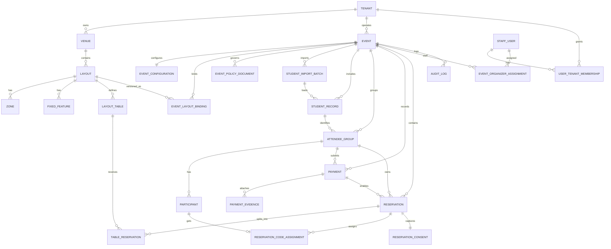

# Data model — Events Administrator (PostgreSQL)

Modelo relacional del MVP **reserva de cupos en mesas** alineado con `PromptsDiseñoApp/4.Modelo_de_datos_gestion_ubicaciones_eventos.md`.

Todas las tablas viven en el esquema `events` para separar el dominio de aplicación de extensiones y objetos globales.

## Estructura de carpetas

| Ruta | Propósito |
|------|-----------|
| `scripts/01_schema` | Extensiones opcionales y creación del esquema `events` |
| `scripts/02_tables` | `CREATE TABLE` (PK, tipos, defaults, `NOT NULL` básicos) |
| `scripts/03_constraints` | FKs, `UNIQUE`, `CHECK` (idempotentes con bloques `DO`) |
| `scripts/04_indexes` | Índices para FKs y consultas frecuentes |
| `scripts/05_seed` | Datos iniciales opcionales (desarrollo / demo) |
| `scripts/06_views` | Vistas de soporte operativo y reporting ligero |
| `scripts/07_functions` | Funciones PL/pgSQL, triggers (`updated_at`) y utilidades |
| `docker/` | `Dockerfile` + `docker-compose.yml` para PostgreSQL local con carga automática |
| `engines/postgresql/` | Notas o scripts específicos de motor |

## Orden de ejecución

Los scripts están numerados para orden **léxico** dentro de cada carpeta. El orden global recomendado es el de las carpetas: `01` → `07`.

Los helpers `scripts/run_all.sh` y `scripts/run_all.ps1` ejecutan **todos** los `.sql` bajo `scripts/` en orden lexicográfico completo (equivalente a la carga Docker).

## Convenciones

- Esquema: `events`
- Tablas y columnas: `snake_case`
- PK: `id UUID` con `gen_random_uuid()` (PostgreSQL 13+)
- Auditoría mínima: `created_at`, `updated_at` donde aplica; triggers en `07_functions`
- Nombres de restricciones: `pk_`, `fk_`, `uq_`, `ck_`, `idx_`

## Docker (recomendado)

1. Copiar variables: `cp docker/.env.example docker/.env` y ajustar contraseña.
2. Desde `data-model/docker`:

```bash
docker compose build
docker compose up -d
```

3. Verificar:

```bash
docker compose exec postgres psql -U events_user -d events_admin -c "\dn+ events"
```

La primera ejecución con volumen vacío corre `/docker-entrypoint-initdb.d/00-load-model.sh`, que aplica todos los `.sql` bajo `/scripts` en orden.

**Nota:** si el volumen ya existía de un intento previo, los scripts de init **no** se repiten. En ese caso: `docker compose down -v` (borra datos) o ejecutar `run_all` manualmente contra la instancia.

## Ejecución manual (sin reconstruir contenedor)

Con `psql` instalado y variables `PG*` o flags:

```bash
# Linux/macOS
export PGHOST=localhost PGPORT=5432 PGUSER=events_user PGDATABASE=events_admin
export PGPASSWORD=...
./scripts/run_all.sh
```

```powershell
$env:PGPASSWORD = "..."
.\scripts\run_all.ps1
```

## Migraciones vs scripts SQL

- **Scripts SQL en repo**: baseline explícito, revisable en PR, útil para DBA y entornos greenfield.
- **Migraciones (Alembic / Flyway / etc.)**: evolución incremental en el tiempo; deben generarse o alinearse a partir de este baseline cuando exista aplicación.

Regla práctica: congelar este modelo como **v0**; a partir del backend, toda alteración pasa por herramienta de migraciones.

## Diagrama entidad-relación (Mermaid)



Nota: en PostgreSQL la tabla de identidad interna se llama `events.staff_user` (evita el identificador reservado `user`).

## Vistas incluidas

- `events.v_table_availability_by_event`
- `events.v_group_payment_status`
- `events.v_event_reservation_summary`
- `events.v_participant_reservation_codes`
- `events.v_event_current_policies`

## Reglas no cubiertas solo con CHECK

Algunas reglas del negocio (concurrencia en reservas, evidencia obligatoria según tipo de pago, suma de cupos vs `approved_ticket_count`) requieren **transacciones** y validación en capa de aplicación o triggers avanzados. Los índices parciales y FKs preparan el terreno; implementar bloqueos (`SELECT … FOR UPDATE` sobre `layout_table`) en el backend.
